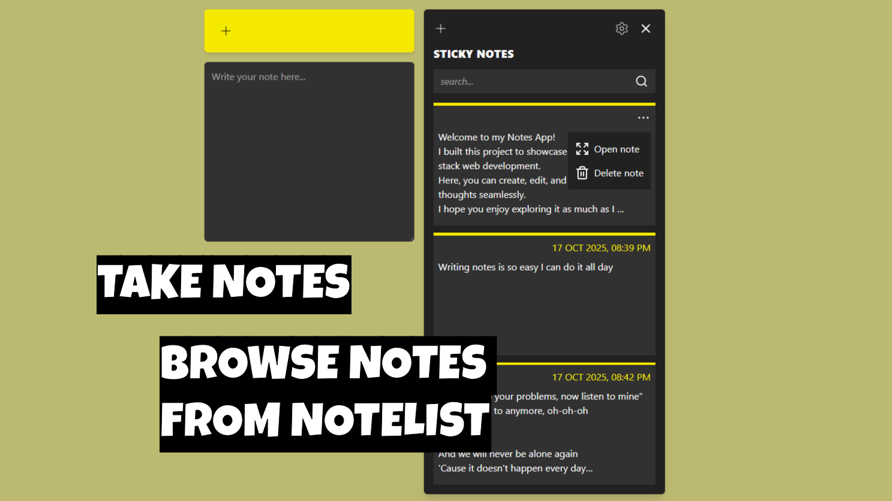
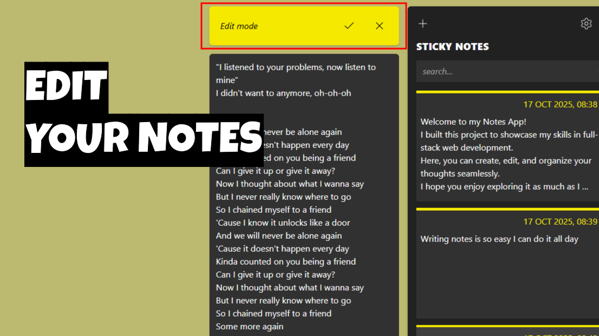
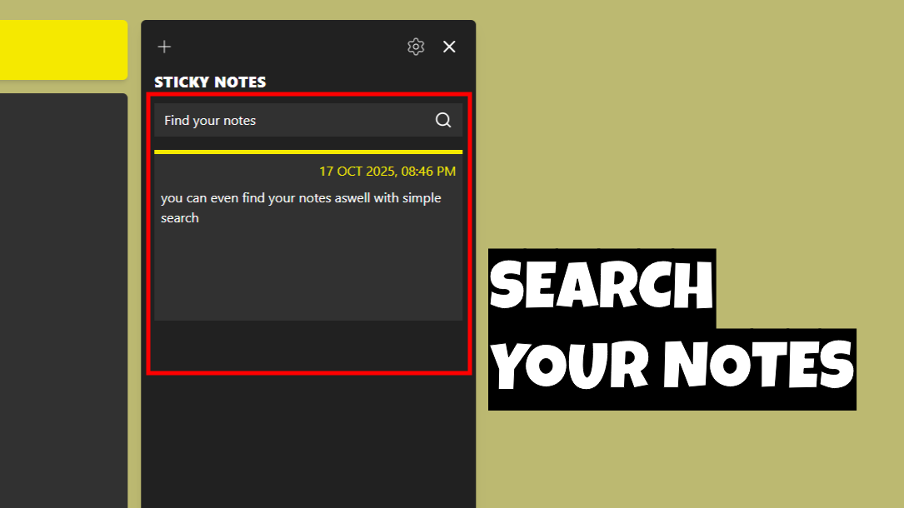
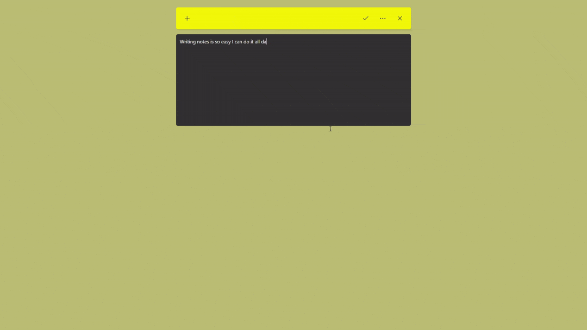

# 🗒️ Sticky Notes - Frontend

<p align="center">
  
  
  
  
</p>

>The **Sticky Notes Frontend** is a modern and responsive note-taking application built with **React.js**, **Redux**, and **Tailwind CSS**.  
It allows users to **create, edit, and delete notes**, offering a seamless and smooth user experience with elegant animations.

---

## 🚀 Features

- 📝 Create, edit, and delete notes effortlessly.  
- 📌 Pin your important notes.
- 📋 Notes are listed in a clean, minimal, and responsive layout.  
- 📱 Fully responsive and optimized for both mobile and desktop screens.  
- ⚡ Smooth animations with **GSAP**.  
- 🧭 State management using **Redux Toolkit** and **React Redux**.  
- 💅 Styled using **Tailwind CSS**.  
- 🎨 Icons powered by **Lucide React**.

---

## 🏗️ Project Structure

```
FRONT/
├── node_modules/
├── public/
├── src/
│   ├── app/              # Redux store setup
│   ├── components/       # Reusable React components
│   ├── features/         # Redux slices for note logic
│   ├── utils/            # Helper functions (e.g., formatDate)
│   ├── App.jsx           # Main app component
│   ├── index.css         # Global styles
│   └── main.jsx          # Entry point
├── .env                  # Environment variables
├── .gitignore
├── eslint.config.js
├── index.html
├── package.json
├── package-lock.json
├── README.md
└── vite.config.js
```

---

## 🧰 Technologies Used

| Category | Technologies |
|-----------|---------------|
| **Frontend Framework** | React.js |
| **Styling** | Tailwind CSS |
| **State Management** | Redux Toolkit, React Redux |
| **Animations** | GSAP |
| **Icons** | Lucide React |
| **Build Tool** | Vite |

---

## ⚙️ Setup Instructions

1. Clone the repository  
   ```bash
   git clone https://github.com/surajbruh/STICKY_NOTE-FRONTEND.git
   ```

2. Navigate to the project folder  
   ```bash
   cd STICKY_NOTE-FRONTEND
   ```

3. Install dependencies  
   ```bash
   npm install
   ```

4. Create a `.env` file in the root directory  
   ```bash
   VITE_API_URL=http://localhost:5000
   ```

5. Start the development server  
   ```bash
   npm run dev
   ```

---

## 🖥️ Screenshots

-- Notes and NoteList


-- Edit mode


-- Searchbar


-- GIF


---

## 🔗 Backend Repository

👉 [Sticky Notes Backend](https://github.com/surajbruh/STICKY_NOTE-BACKEND)

---

## 🤝 Contributing

Feel free to fork the repository, open issues, or submit pull requests.

---

## 🧑‍💻 Author

**Suraj Yadav**
Full Stack Web Developer  

💼 [LinkedIn](https://www.linkedin.com/in/suraj-yadav-b15a1b36b/)
🔗 [GitHub](https://github.com/surajbruh)

---

⭐ **If you like this project, don’t forget to give it a star!**